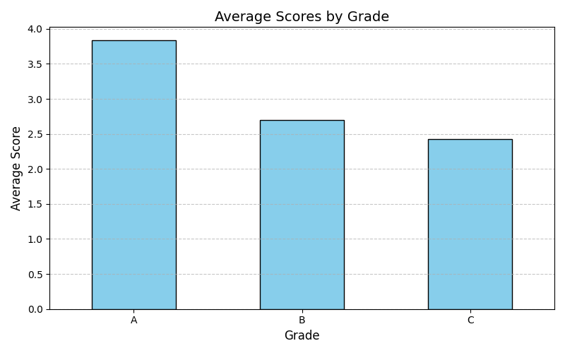
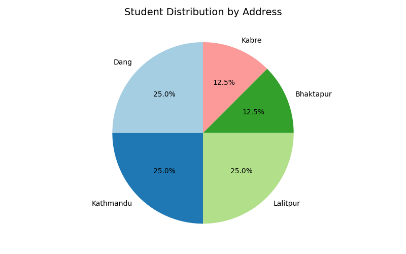

# Data Cleaning, Analysis, and Visualization in Python

## Objectives

1. Load data from an Excel file.
2. Clean the data by removing duplicates, converting columns to appropriate data types, and handling missing values.
3. Perform data analysis by calculating average scores by grade and visualizing the results.
4. Save the cleaned data to a new file (CSV and Excel formats).

## Background Theory

1. *Pandas*: A powerful data manipulation and analysis library for Python, used for handling structured data like Excel and CSV files.
2. *Matplotlib*: A library for creating static, animated, and interactive visualizations in Python.
3. *Excel Data*: Data is stored in an Excel file, where it can be cleaned and analyzed using Python libraries like Pandas and Matplotlib.

## Procedure

1. Loaded data from an Excel file (`Data.xlsx`).
2. Cleaned the data by:
   - Removing duplicates based on selected columns.
   - Converting the 'Age' and 'Score' columns to numeric data types.
   - Dropping rows with missing or invalid data.
3. Performed data analysis by:
   - Grouping the data by 'Grade' and calculating the average score for each grade.
   - Created a bar chart to visualize the average scores by grade.
   - Created a pie chart to visualize the distribution of students by address.
4. Saved the cleaned data to new CSV and Excel files.

## Outputs

### Cleaned Data:
The output of the cleaned data:
   S.N.           Name   Age Gender Grade  Score    Address
      1     Milan Raut  23.0      M     A   3.80       Dang
      2  Amir Shapkota  22.0      M     A   3.90  Kathmandu
      3   Anjan Sharma  23.0      M     B   2.60       Dang
      4      Ram Dahal  24.0      M     C   2.40   Lalitpur
      5    Sita Gurung  21.0      F     A   3.80  Bhaktapur
      6      Hari Daas  20.0      M     B   2.80      Kabre
      7     Gita Magar  22.0      F     C   2.45  Kathmandu
      8  Shyam Bahadur  24.0      M     B   2.70   Lalitpur

### Visualizations:
- **Average Scores by Grade**:
- **Student Distribution by Address**:

## Conclusion

This project demonstrated the use of Python libraries such as Pandas and Matplotlib for data cleaning and analysis. We successfully loaded, cleaned, and visualized the data, providing insights into the average scores by grade and the distribution of students by address. The cleaned data was also saved to new CSV and Excel files for further use.